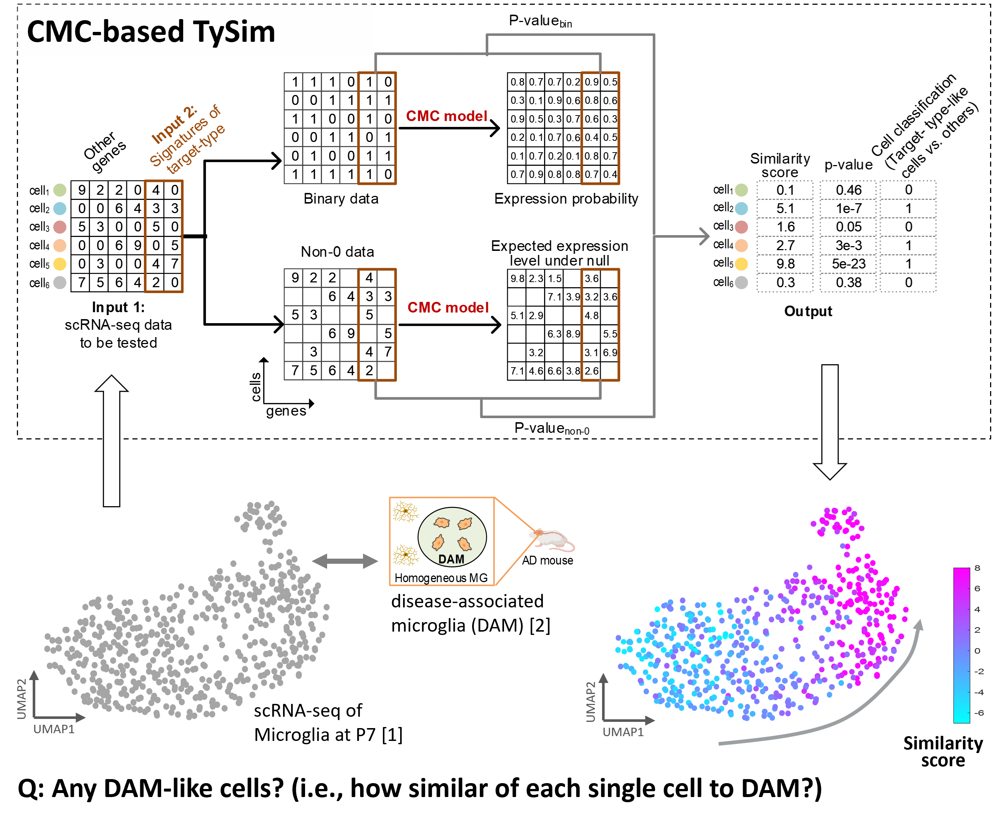
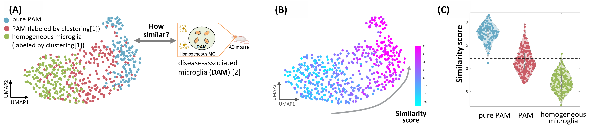

# What is TySim?

TySim is a quantitative metric of single-cell-to-target-cell-type similarity, on the basis of scRNA-seq data and the signatures or differentially expressed gene (DEG) list of the target cell type. In other words, it quantifies to what level each single cell is similar to the target cell type.

<!-- If you have any feedback or issue, you are welcome to either post issue in the Issues section or send an email to yug@vt.edu (Guoqiang Yu at Virginia Tech). -->

<!--  ### Overview of TySim -->
<p align="center">
  
  <!--  <figcaption>Overview of TySim</figcaption> -->
</p>


# How it work?


# Why TySim?


# Case studies using TySim
### 1) TySim confirm Proliferative-region-associated microglia (PAM) similar to disease-associated microglia (DAM) 

<br>


<p align="center">
  
  <!--  <figcaption>Overview of TySim</figcaption> -->
</p>


# Installation

```
library(devtools)
devtools::install_github("ZuolinCheng/TySim")
```

# Usage


# Cite

Please cite our paper if you find the code useful for your research.

Z. Cheng, S. Wei and G. Yu, "[A Single-Cell-Resolution Quantitative Metric of Similarity to a Target Cell Type for scRNA-seq Data](https://ieeexplore.ieee.org/abstract/document/9995574)," 2022 IEEE International Conference on Bioinformatics and Biomedicine (BIBM), Las Vegas, NV, USA, 2022, pp. 2824-2831, doi: 10.1109/BIBM55620.2022.9995574.


```
@inproceedings{TySim,
  title={A Single-Cell-Resolution Quantitative Metric of Similarity to a Target Cell Type for scRNA-seq Data},
  author={Cheng, Zuolin and Wei, Songtao and Yu, Guoqiang},
  booktitle={2022 IEEE International Conference on Bioinformatics and Biomedicine (BIBM)},
  pages={2824--2831},
  year={2022},
  organization={IEEE}
}
```


